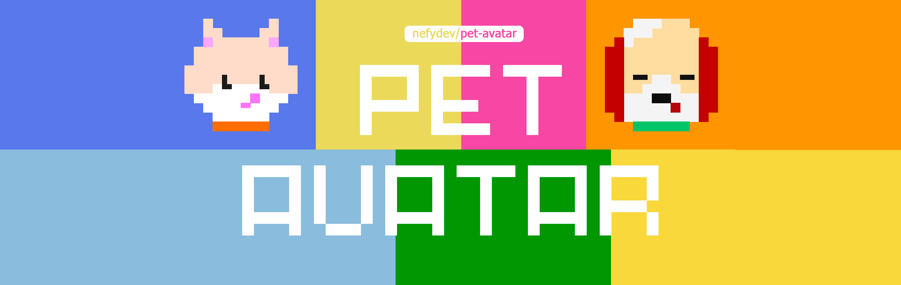
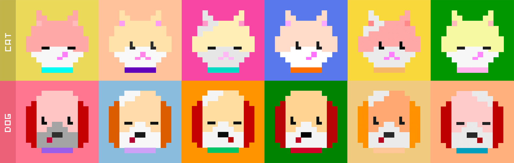

# Pet Avatar 

Generate a random cute avatar using the GD Library

## Preview



## Requirements

- PHP 7.4 or later
- PHP GD extension must be enabled

## Installation

You can install the package via composer:

```bash
composer require nefydev/pet-avatar
```
To setup the config file:

```bash
php artisan vendor:publish --provider="Nefydev\PetAvatar\PetAvatarServiceProvider"
```

## Usage

```php
    use Nefydev\PetAvatar\Facades\PetAvatar;
    ...

    // generate a cute random avatar
 	$avatar = PetAvatar::generate(); 

    // shows the file name 
    echo $avatar; 
```

## Contributing

Please see [CONTRIBUTING](CONTRIBUTING.md) for details.

## Credits

-   [Nefy](https://github.com/nefydev)
-   [All Contributors](https://github.com/nefydev/pet-avatar/contributors)

## License

The MIT License (MIT). Please see [License File](LICENSE.md) for more information.

## Support

[](https://ko-fi.com/E1E5BQUXC)